# 注意力 AllReduce 与 MoE 计算重叠：改的是一层内部的指令排布

8 卡 PCIe 服务器（无 NVLink）· 78 层 MoE + 稀疏注意力模型 · TP8
每步 prefill `1.566 s → 1.526 s`（+2.6%）· 端到端 `+2.8% / +6.8% / +7.7%`（C=8/16/32）

---

## 0. 一句话

模型每层在 MoE 之前要做一次全量的张量并行 AllReduce（AR）。改之前它整段挡在关键路径上；
改之后把这次 AR 的**发送行切成两片扔到一条侧流**，主流拿着第一片就往下走，第二片藏在第一块
MoE 的算力里。省下来的是 AR 挡路的那 1.77 ms，付出去的是「并发让算力变慢」和「拆两次的固定
开销」——两头都能实测，账目逐位对得上。

**收益不来自「少通信」**：字节数一个没少（100.66 MB 还是 100.66 MB，只是拆成两片）。
收益全部来自「同一段时间里多干了活」。

---

## 1. 改了什么

### 1.1 站点（这里踩过坑）

第一版补丁挂在 `o_proj` 的 AR 分支上，**日志显示"已激活"，吞吐却纹丝不动**——因为注意力输出
投影是用 `reduce_results=False` 构造的，那个 `if reduce_results and tp_size > 1` 分支**永不执行**。

真正的站点是 **MoE 之前的那次后置 AR**：`LayerCommunicator.prepare_mlp` 内部走
`_gather_hidden_states_and_residual` 的 `attn_dp_size == 1` 分支，先做张量并行的 AR，紧接着做
`post_attention_layernorm`。

计数证据与站点结论一致：每步 int8 AR 内核 **156 次** = 78 层 × 2（78 次注意力 AR + 75 次 MoE AR
+ 3 次稠密层 AR）。

> 教训：往模型里塞补丁前，必须用不可否认的日志证明那段代码真的被执行。

### 1.2 代码形状

```diff
  # 一层里 MoE 之前
- hidden, residual = prepare_mlp(hidden, residual)   # 全量 AR（100.7 MB）挡在关键路径上
- moe_out = moe(ln(hidden))                          # LN 与 MoE 只能等 AR 做完
+ hidden, residual = dispatch(hidden, residual)      # 占位：AR 切成 2 片扔到侧流，主流不等
+ # 主流拿第 0 片就开始：块 i 只等第 i 片 AR
+ moe0 = moe(ln(wait(shard[0])))                     # 第 1 片 AR 与这段算力并发
+ moe1 = moe(ln(wait(shard[1])))
```

```text
forward_layer
├── join()                      # 等上一层 MoE 的 AR（消费者是本层注意力）
├── self_attn(...)
├── dispatch(hidden, residual)  # 切 2 片 → 串行投到唯一一条侧流，逐片记 event
│   ├── side_stream: AR(shard[0]) → event0
│   └── side_stream: AR(shard[1]) → event1
└── chunk loop
    ├── chunk 0: wait(event0) → LN → MoE    # 与 shard[1] 的 AR 并发
    └── chunk 1: wait(event1) → LN → MoE
```

层入口与最终 norm 之前各放一个 join，这样相邻两层之间也顺带形成跨层流水。

---

## 2. 一层的时间线

把注意力算力结束之后到 MoE 结束这段拉直看，**同一横轴**，所以改后那行短掉的部分就是净省。

**改之前**

```mermaid
gantt
    dateFormat X
    axisFormat %s
    section 主流
    AR 一次 100.7 MB（3.27 ms） :done, a1, 0, 327
    LN + MoE 算力（4.79 ms）     :active, a2, 327, 806
    section 侧流
    空闲 :crit, a3, 0, 806
```



**改之后**

```mermaid
gantt
    dateFormat X
    axisFormat %s
    section 主流
    MoE 块 0（2.73）      :active, b1, 0, 273
    MoE 块 1（2.70）      :active, b2, 273, 543
    省掉（2.63）          :crit, b3, 543, 806
    section 侧流
    AR 片 0（1.77，暴露） :done, c1, 0, 177
    AR 片 1（1.77，藏）   :done, c2, 177, 354
```



改后主流的 5.43 ms 比改前的 4.79 ms **长**——因为 AR 在侧流上与它抢带宽和 SM，这正是下面账本
里的 `+0.64`。**省下的不是算力，是等待。**

---

## 3. 逐笔账：藏 1.77 ms，落袋 0.78 ms

| 项 | 实测 | 说明 |
|---|---|---|
| 第 1 片 AR 不再挡路 | **−1.77 ms** | 原设计目标：1.77 ms 移出关键路径 |
| 代价一：并发让算力变慢 | **+0.64 ms** | 两块 MoE 算力 4.79 → 5.43 ms（+13%）。单个大 GEMM 的探针只慢 1.8%，MoE 是几十个小内核，抗干扰差得多 |
| 代价二：拆两次的固定开销 | **+0.35 ms** | 两次 50.3 MB（1.77+1.77）比一次 100.7 MB（3.27）慢 11% |
| **净赚 / 每层** | **−0.78 ms** | 换算出整层 Δ = −0.79 ms，与账本逐位吻合 |

```text
落袋率 = 0.78 ÷ 1.77 ≈ 0.44
```

**推论**：每藏住 1 ms 的 AR，只换回约 0.44 ms 的墙钟。这条「打折」决定了整条路线的天花板——
把每层剩下的 AR 全藏进相邻层的算力，prefill 每步最多再涨 1~2%。

> **常见误读**：「把 AR 藏进算力，就等于省下 AR 的全部时间」。
> 不是。AR 与算力是**抢同一份资源**的：藏进去的 AR 会让同时进行的算力变慢，而这部分代价要原样
> 记回账上。本例里 1.77 ms 的藏入换回 0.78 ms —— 边际回报 0.44，不是 1.0。

---

## 4. 为什么收益随 TP 规模递减

同一份补丁，在三种并行布局上测出来的收益完全不是一个量级（同容器 A/B，容器内只切开关、不重启）：

| 并行布局 | 16K→512 C=8 | C=16 | C=32 | 结论 |
|---|---|---|---|---|
| TP8 × PP1 | **+2.8%** | **+6.8%** | **+7.7%** | 最划算的一档，也是本补丁的目标场景 |
| TP4 × PP2 | +1.1% | +3.1% | +3.5% | 可用，收益有限 |
| TP2 × PP4 | **−2.7%** | +2.5% | +1.3% | 净 ≈ 0，不值得上 |

三点机理，都是可查的：

1. **AR 的绝对时长随 rank 数增长。** TP8 要跨 8 张卡做归约，TP2 只在 2 张卡之间交换——后者被暴露
   的那段本来就短得多，能藏的上限就低。
2. **PP 的流水已经掩盖了一部分。** TP2×PP4 布局下，PP 的四个 stage 本来就在互相填对方的等待，
   留给「再重叠一次」的空隙更小。
3. **收益正比于「被暴露的 AR」，而不是模型规模。** 所以这补丁不是「越大的卡越划算」，而是
   「被暴露的通信越长越划算」——在这台纯 PCIe（无 NVLink）机器上，TP8 恰是暴露最长的那一档。

### 每片的字节数（可自核的算术）

```text
全量 AR 载荷 = 行数 × hidden(6144) × 2 字节
每片载荷     = 全量 ÷ K(2)
```

| extend batch 行数 | 全量 | 每片 | 日志实测 |
|---|---|---|---|
| 8192 | 100.66 MB | 50.33 MB | 50.3 MB（TP8 / TP4） |
| 16384 | 201.33 MB | 100.66 MB | 100.7 MB（TP2） |

**字节数没有变少**——整段 AR 还是 100.66 MB，只是从「一次搬完」变成「分两次搬、第二次不挡路」。

---

## 5. 实现边界：它只在 prefill 生效

补丁的每个入口都带闸门，任一不满足就**逐字回退到原路径**（不是近似，是完全不介入）。

| 闸门 | 原因 |
|---|---|
| 只在 extend（prefill）批次 | decode 每步每请求只有 1 个 token，行数远低于分块下限（1408 行），切片本身就没有可藏的量 |
| CUDA 图捕获期不介入 | 捕获期不能引入新的流与事件语义；检测到 `is_current_stream_capturing()` 直接走原路径——图内数值因此逐比特不变 |
| 行数足够多才切 | 每片必须是 256 的整数倍且不低于下限，避免把一次通信拆成一堆小包 |
| AR 与 LN 未被融合内核吸收 | 若框架把 AR 与 LayerNorm 融进一个内核（sm90/sm100 或 AMD 路径），「先 AR 后 LN」的假设不成立 |
| 逐块修正 token 计数 | 分块后每块要单独告诉内核「本块有多少有效 token」，否则 padding 会被算进 LN 的统计量里——这是分块版本第一版数值崩坏的根因 |
| 模式开关放在内存槽里 | 热路径（每层每 rank 都读）不做任何文件系统调用，开关由后台线程每 1 s 读一次。曾因为热路径上多了一次 `open()` 而让服务在首个大步 prefill 上挂死 |

---

## 6. 怎么验证的：同容器 A/B

跨容器对比的噪声可以到 5%，所以所有收益数字都来自**同一个容器、不重启、只切一个开关**的四相
A/B/A——两头都是基线，用来夹住漂移。

| 相 | 配置 | 吞吐 tok/s | 每步 prefill | 说明 |
|---|---|---|---|---|
| P1 base | 不切分 | 121.46 | 5232 tok/s ⇒ 1.566 s | 与未打补丁的服务逐字相同 |
| P2 chunk | MoE 分块 | 126.63 | 5251 ⇒ 1.560 s | 只有分块，AR 仍未切 |
| **P3 split** | **分块 + AR 切片** | **129.04** | **5367 ⇒ 1.526 s** | **本轮机制** |
| P4 base2 | 不切分 | 120.05 | 5229 ⇒ 1.567 s | 收尾再测基线 |

P1 与 P4 同为基线，5232 对 5229 tok/s ⇒ 漂移带 **0.06%**。所以 P3 相对基线的 **+2.6%/步** 可信。

### 6.1 数值等价怎么证的

不能靠「逐位相等」——8192-token 的 prefill 落在量化 AR 区间内，**基线自身跨进程就跑不出相同
结果**。改用偏差分布：固定提示词、取生成首 token 的 logprob 与 top-5 分布，同一配置跑两次得到
噪声底，再与改配置比。三次运行的首 token 都是同一个 id，logprob 落在基线的噪声带内。

功能正确性另用七个用例的质量门（数学 × 5 + 中文推理 + 工具调用）把住，改前改后都是 **7/7 通过**。

### 6.2 两条容易踩的坑

- **坑一：把补丁打进「不会执行」的分支**（见 §1.1）。日志说「已激活」，吞吐不动，因为那段代码
  在配置下永不执行。必须用不可否认的计数证据钉死站点。
- **坑二：短提示词的质量门测不到分块路径**。质量门的提示词只有几百 token，**够不到分块阈值的
  行数**，所以「短提示词过质量门」不能证明分块路径数值正确。它必须由长提示词（8192 token）的
  logprob 对照来补。这是本类改动最容易漏的一环。

---

## 7. 相关

- 页面对应的可视化版本：`index.html`（含两个可拖动的交互：TP 规模 → 实测增益；batch 行数 →
  每片字节数）
- 同批次的另一篇：1-stage → 2-stage AllReduce（`../allreduce-1stage-vs-2stage/`），讲的是
  「少搬字节」这条正交的轴

数据来自 2026-09 的一次内部优化实验。内部主机名、模型版本号、内部文档与环境变量名已做脱敏。