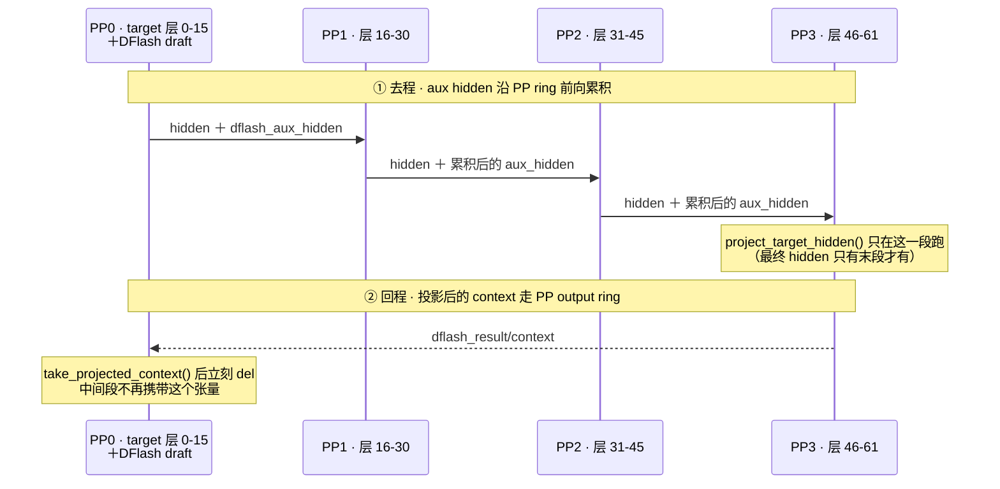

# PP 适配 DFlash：伪造单例 PP 组 + 两条跨阶段数据流

> 归档说明：2026-09-16 用 show-me 问「PP 适配 DFlash 做了什么改动」时只给了聊天回答，没有落盘；此文件由会话记录重建，代码片段与结论未改动，仅对内部标识做了脱敏。
>
> 学习增强版（前置知识、方案取舍、常见误解、自测题）见 [index.html](index.html)。

## 一、要解决的根本矛盾

上游 SGLang **硬性禁止** DFlash 与 PP 共存，三道护栏都在启动期直接报错：

```python
# speculative_hook.py
if cfg.pp_size != 1:
    raise ValueError("Currently DFLASH speculative decoding only supports pp_size == 1.")

# server_args.py
assert (cfg.disable_overlap_schedule and cfg.speculative_algorithm is None), \
    "Pipeline parallelism is not compatible with overlap schedule, speculative decoding"

# layer_setup.py — 推测层的选取条件里没有 DFlash 分支
```

而即使放开护栏，DFlash 的数据流仍假设「只有一个 rank」：草稿模型是个独立的小模型、需要目标模型多个中间层的 hidden state、还需要 LM head。这些在 PP4 下**分散在四个阶段上**。

## 二、改动分四块

### A. 放开护栏（全部门控在 `DFLASH_PP_INIT_PROBE=1` 下）

三个文件各 1~4 行，都是 `and os.environ.get("DFLASH_PP_INIT_PROBE") == "1"` 形式的条件放宽。**没有改算法，只是把禁入改成可入**，且保留开关随时可退回。

### B. 草稿模型不切分——伪造单例 PP 组

`dflash_pp_scope.py`（新增，1.5 KB）是整个适配的钥匙：

```python
def create_singleton_pp_group():
    # 每个 rank 建一个 world_size=1 的"PP 组"（集合操作，全 rank 同序参与）
    return ps.init_model_parallel_group(group_ranks=[[rank] for rank in range(world_size)], ...)

@contextmanager
def draft_pp_scope(group):
    ps._PP = group                                  # 临时替换全局 PP 组
    with get_parallel().override(pp_size=1, pp_rank=0, pp_group=group):
        yield                                       # 世界对草稿模型来说退化成 PP=1
```

worker 侧对应地把 `ps` 替换后构建，并把 forward 也包进同一个 scope：

```python
self._draft_pp_group = create_singleton_pp_group() if ps.pp_size > 1 else None
with self._draft_scope():
    bundle = build_draft_tp_worker(ps=replace(ps, pp_rank=0, pp_size=1), ...)
...
with torch.inference_mode(), self._draft_scope():
    draft_out = self.draft_model_runner.forward(forward_batch)
```

**关键点：6 层的草稿模型整体跑在 PP0 上，不参与流水切分。** 构造和 forward 都必须进 scope，因为两者都读并行状态。

### C. 两股跨阶段数据流（这是真正的工作量）



**去程**：DFlash 需要 `layers_to_capture` 这几层的 hidden state，而它们散落在四个阶段。每个阶段只打包**本地**的捕获：

```python
local_capture_count = (sum(self.start_layer <= i < self.end_layer for i in self.layers_to_capture)
                       if dflash_pp_capture else len(self.layers_to_capture))
```

然后把 `dflash_aux_hidden`（形状 `[rows, preceding*hidden]`）挂进 PP ring 往下传，每段校验 shape/dtype/device 后追加自己那份。

**回程**：投影必须发生在**末段**，然后结果沿 output ring 绕回 PP0。所以有了 `dflash_pp_result.py`——一个带 `dflash_result/` 前缀的信封，装 bonus token、seq_len、block_size、commit_len。里面每处都 `.clone()`，注释说明了原因：

> Queued PP outputs must survive subsequent graph/static-buffer reuse.

即 PP ring 会把包**跨微批排队**，而 worker 的 buffer 会被复用（CUDA graph 静态缓冲），所以必须存快照而非引用。

### D. PP0 缺的东西要补

`dflash_pp_lm_head.py`（新增）——PP0 上没有 LM head（它只在末段），所以**直接从 checkpoint 单独加载一份不带量化的、按 TP 切分的 `lm_head.weight`**，注释开头就写明了 "for drafting on the **first PP stage**"。同时 `_resolve_dflash_embedding_module` 会优先用这份副本。

## 三、一个容易漏掉的正确性 bug

```diff
- return PPProxyTensors({k: v[: self.bs] for k, v in output.tensors.items()})
+ return PPProxyTensors({k: v[: self.raw_num_token] for k, v in output.tensors.items()})
```

**投机解码下一条请求产生 `block_size` 个 token 行，按请求数 `bs` 切片会丢行。** 以及 verify 的图预规划：

```python
if pp_proxy_tensors is not None:
    # Verify planning precedes receipt of the preceding PP stage.
    # Refresh its activations now, even when attention metadata is ready.
```

——**这和同项目里 PP+MTP 的 r37 补丁是同一类 bug**（pre-planned verify 路径遗漏 pp_proxy 填充，末段 CUDA graph 读到旧缓冲）。同一个坑在 MTP 和 DFlash 上各踩了一次。

## 四、配套的调度改动

| 文件 | 改动 | 目的 |
|-|-|-|
| `scheduler.py` (+24/-17) | DFlash+PP 时不再原地更新 batch 状态，改由 output ring 完成 | "PP completion is handled on the output ring instead" |
| `scheduler_pp_mixin.py` (+94/-22) | 加 `dflash_append_plan`；收发两侧挂 `add_result`/`restore_result`；信封一致性校验 | 携带 draft 状态穿过 ring |
| ↳ 时序优化 | **提前发 proxy**："KV release can synchronize the host. Send the current proxy first so the peer can launch its forward before that wait." | 让下游段早启动 |
| `base_runner.py` (+14/-2) | `residual_shape` 从 `(max_bs, hidden)` 改为 `(max_num_token, hidden)`；autotune 时伪造 aux 张量 | verify 每请求多行 |
| `decode_cuda_graph_runner.py` (+17/-1) | 图内预分配 `dflash_aux_hidden` 缓冲 | 图捕获需要静态形状 |

## 五、明确未接通的部分（能力边界）

```python
if batch.is_extend_in_batch and not batch.forward_mode.is_extend():
    raise RuntimeError('DFlash PP mixed decode/prefill is not connected')
if forward_batch.can_run_tbo or is_cp_v2_active(...):
    raise NotImplementedError("DFlash PP capture requires unsharded eager rows")
```

**混合 decode/prefill 微批不支持、TBO/CP 不支持**，加上 `--cuda-graph-backend-prefill disabled` —— 这些正好对应 profile 里看到的 prefill attention 0% 图覆盖。

---

**一句话概括**：这次适配没碰 DFlash 的算法，而是（1）放开三道禁入护栏，（2）用一个伪造的单例 PP 组让草稿模型在 PP0 上以 PP=1 的视角独立运行，（3）新设计两条跨阶段数据通道——aux hidden 沿 ring 前向累积、投影 context 沿 output ring 绕回——并把 draft 状态装进信封穿环传递，同时补上 PP0 缺失的 LM head 副本。

代价也清楚：草稿模型集中在一个阶段，**PP0 因此比其他段忙**（profile 里 PP0 busy 25.98s vs PP1-3 的 21.8~23.3s），且 prefill 放弃了图捕获。